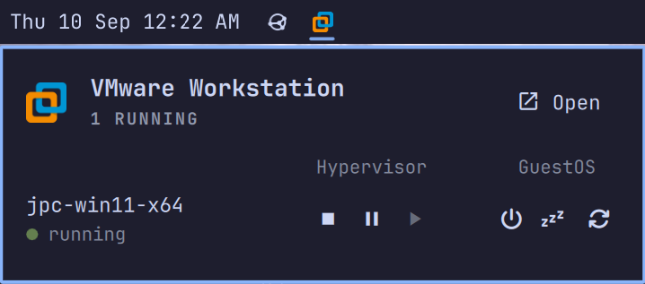

# VMware Workstation

Lists the Workstation library in the Omarchy bar and runs power/guest actions through `vmrun`.



## Install

Plugins run as unsandboxed code inside `omarchy-shell`. Only add repos you trust.

```sh
omarchy plugin add https://github.com/cavanaug/omarchy-vmware-workstation.git --enable
```

## Requirements

- [Omarchy](https://omarchy.org/) Quattro with the shell plugin CLI
- VMware Workstation so `vmrun` is on `PATH`
- Library entries in `~/.vmware/inventory.vmls` (this plugin does not scan `~/vmware/`)

## What it does

A Workstation mark on the bar. Click it for the panel: how many VMs are running, **Open** to launch Workstation, and one row per library VM.

Unavailable actions stay visible and dimmed.

| Group | Action | When enabled |
| --- | --- | --- |
| Hypervisor | PowerOff | running, suspended |
| Hypervisor | Suspend | running |
| Hypervisor | Resume | off, suspended (starts a powered-off VM) |
| Guest | Shutdown | running |
| Guest | Sleep | running |
| Guest | Startup | off, suspended (starts a powered-off VM) |
| Guest | Restart | running |

Guest actions stay enabled whenever the VM is running. The plugin does not probe VMware Tools; if Tools is missing the action fails and the panel shows the error.

Resume and Startup run `vmrun start` without the `gui` option, so VMs start headless; use **Open** to bring up the Workstation console.

## Settings

Configure the widget in Omarchy bar settings.

| Setting | Default | |
| --- | --- | --- |
| Bar icon | branded | `branded` (color Workstation mark) or `themed` (mono, tinted to the bar) |
| Refresh interval (seconds) | 30 | 5–3600, step 5 |
| Keyring password for encrypted VMs | off | Opt-in. Reads the saved VM password from your keyring and passes it to `vmrun -vp` on the command line. Read the [Security notes](#security-notes) before enabling. |

## Security notes

Encrypted VMs need a password before `vmrun` can start or resume them. VMware's CLI accepts that password in exactly one way: `-vp <password>` on the command line — `vmrun` has no env var, stdin, prompt, or keyring interface (verified against `vmrun` 1.17; the binary links no keyring libraries). Workstation's "remember password" saves the secret to your desktop keyring, but only the Workstation GUI reads it back — `vmrun` never does.

**Keyring password for encrypted VMs (off by default)** — when enabled, before each action the plugin looks up the saved secret (by `.vmx` path, falling back to `encryptedVM.guid`) and runs `vmrun -vp <pw>`, reproducing the GUI's behavior for CLI users.

What you are accepting by enabling it:

- While `vmrun` runs, the password is visible in `ps` and `/proc/<pid>/cmdline` to **every local user account**. procfs command lines are world-readable by default on Linux (no `hidepid`).
- The exposure is scoped: only start/resume of an encrypted VM injects the password, `vmrun` exits in seconds, and nothing is written to disk or logs by this plugin. Stop/suspend/reset of an already-running VM never use it.
- Your keyring is already accessible to any process running as your user; enabling this extends equivalent access to every account on the machine (and root) for the duration of the call.

If the machine has other users, prefer one of these instead:

- Leave the setting off — encrypted VM actions fail with `A password is required for this operation`, shown in the panel.
- Decrypt the VMs (Workstation: VM → Manage → Remove Encryption) so no password is needed at all.
- Mount procfs with `hidepid=2` so users cannot see each other's processes.

## Update

```sh
omarchy plugin update io.github.cavanaug.vmware-workstation
```

## Remove

```sh
omarchy plugin remove io.github.cavanaug.vmware-workstation
```

Removal deletes the plugin checkout (or unlinks a symlink) and the `shell.json` entry. It does not delete VMs, `.vmx` files, or `~/.vmware/inventory.vmls`.

## Troubleshooting

- **`vmrun is not installed or not on PATH.`** The icon still shows. Open still works if Workstation is installed. The list is empty.
- **Empty panel, no error.** Inventory is missing or has no VMs.
- **All six actions dimmed.** The `.vmx` path in inventory is missing on disk.
- **Action error.** One line under the list. The next successful poll or action clears it.

Bind or script the panel with:

```sh
omarchy-shell io.github.cavanaug.vmware-workstation toggle
```

Also: `open`, `close`, `refresh`.

## Development

```sh
node check.js
omarchy plugin validate .
```

## License

MIT. See [LICENSE](LICENSE).

Not affiliated with, sponsored by, or endorsed by Broadcom or VMware.
